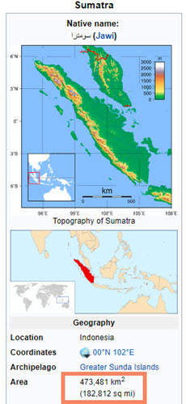

```{r setup, include=FALSE}
knitr::opts_chunk$set(comment = "")
knitr::opts_chunk$set(echo = FALSE)
library(plotly)
library(shiny)
```

## The source data

The source data for our application is the R data set "island" which provides islands size in thousand square miles:
```{r data, echo = FALSE}
data(islands)
isl <- data.frame(name=names(islands), size=islands, stringsAsFactors = FALSE)
isl$name <- factor(isl$name, levels = unique(isl$name)[order(isl$size, decreasing = TRUE)])
plot_ly(isl,x=~name,y=~size,colors="YlOrRe",type="bar")
```

## The User Interface

Our Shiny interface takes two input:
<br>1. The dream destination island, in variable *inputValue*
<br>`selectInput('inputValue'`
<br>`       , 'Pick up your favorite destination'`
<br>`       , names(islands)`
<br>`       , selected = "Tasmania")`
<br>
<br>2. The area unit to convert the island size, in variable *conversion*
<br>`radioButtons('conversion'`
<br>`, 'Choose the unit to convert the Island Size into'`
<br>`, c("Acre"=1`
<br>`   ,   "Hectare"=2`
<br>`   ,   "Square Kilometer"=3`
<br>`   ,   "Number of Football Field"=4)`

## The Server
The Shiny server uses a conversion table based on square miles.
For example, 1 square miles represents 484 football fields.
```{r conv, eval = TRUE, echo=FALSE}
conversions<-c(
    # 1 square miles corresponds to 640 acre
    "Acres"=640
    # 1 square miles corresponds to 258.999 hectare            
    ,"Hectares"=258.999
    # 1 square miles corresponds to 2.589 square kilometer
    ,"Square Kilometers"=2.589
    # 1 square miles represents the size of 484 football fields
    ,"Number of Football Fields"=484)
```
```{r conv view, eval = TRUE, echo=TRUE}
t(conversions)
```
The server reactively returns three variables to the interface:
<br>1. *island*: The island name
<br>`output$island <- renderPrint({ input$inputValue })`
<br>2. *size*: the size in square miles calculated in a reactive function
<br>`output$size <- renderPrint({ mySizeFun() })`
<br>3. *convertedSize*: the size converted into selected area unit
<br>`output$convertedSize <- renderPrint({ myConvertedSizeFun()  })`


## It's your turn!
<div class="columns-2">
 

According to Wikipedia, the size of Sumatra is 473,481 square kilometers.
<br>
<br>Go and check whether the approximate converted size calculated by 'myConvertedSizeFun()' matches the value from the encyclopedia using <a href="https://genfrenot.shinyapps.io/Shiny/" class="uri">The Destination Island Application</a>
<br>
<br>Source for this presentation and the application on GitHub: https://github.com/GenFrenot/Shiny
</div>
